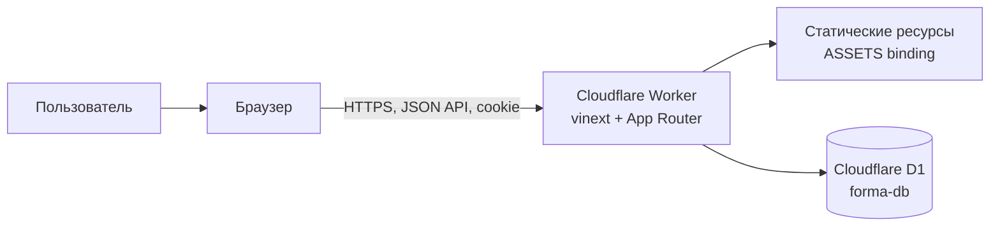
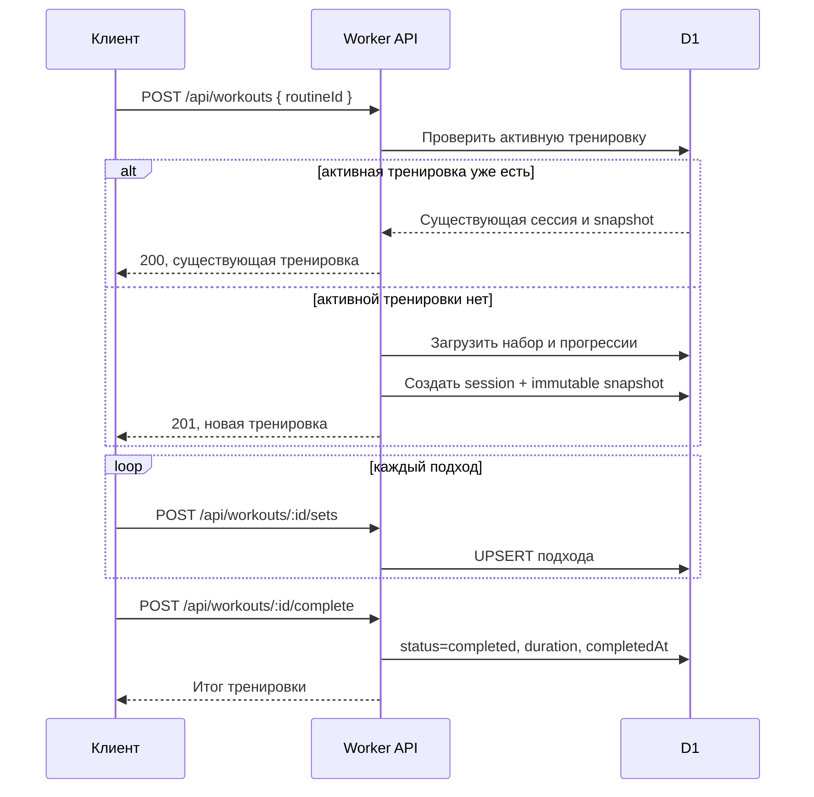

# Архитектура Forma

Статус: **AS IS — текущая реализация**

Этот документ описывает техническую архитектуру Forma по исходному коду. Продуктовые
правила и пользовательские сценарии находятся в [`docs/specs`](../specs/).

## Назначение системы

Forma — full-stack веб-приложение для тренировок по калистенике. Авторизованный
пользователь может:

- создавать и редактировать наборы упражнений;
- выбирать прогрессию упражнения отдельно для каждого набора;
- начать одну активную тренировку;
- записывать выполненные подходы и оценку усилия;
- завершить тренировку и просматривать историю.

## Контекст и компоненты



Приложение разворачивается как один Cloudflare Worker `forma`. Отдельных
микросервисов, очередей, фоновых обработчиков и внешнего API в текущей версии нет.

### Клиент

- `app/layout.tsx` формирует корневой HTML и динамические metadata.
- `app/page.tsx` подключает единственный корневой экран приложения.
- `app/FormaApp.tsx` — клиентский React-компонент, который хранит состояние экранов,
  вызывает API и реализует весь основной пользовательский поток.
- `app/globals.css` содержит глобальное оформление.
- `lib/workout-catalog.ts` — статический каталог упражнений и три стартовых набора.

Навигация внутри приложения реализована состоянием React, а не отдельными URL.
После перезагрузки клиент восстанавливает пользователя, наборы, прогрессии, активную
тренировку и историю через API.

### Сервер

HTTP-обработчики находятся в `app/api/**/route.ts` и выполняются в Worker:

- `auth` — регистрация, вход, выход, текущий пользователь и запрос восстановления;
- `routines` — инициализация стартовых наборов и CRUD пользовательских наборов;
- `progressions` — выбранные прогрессии для упражнений в наборах;
- `workouts` — старт, восстановление активной тренировки и история;
- `workouts/:id/sets` — запись или обновление подхода;
- `workouts/:id/complete` — завершение тренировки.

Общая серверная логика вынесена в:

- `lib/auth.ts` — cookie-сессии, PBKDF2, получение текущего пользователя;
- `lib/http.ts` — чтение JSON и единый JSON-ответ без кеширования;
- `lib/routines.ts` — валидация набора;
- `lib/workout-catalog.ts` — допустимые упражнения и их тренировочные параметры.

Полный HTTP-контракт описан в [api.md](api.md).

### Хранилище

Единственное постоянное хранилище — Cloudflare D1, доступное через binding `DB`.
Схема объявлена в `db/schema.ts`, миграции хранятся в `drizzle/`.

Drizzle используется для описания схемы и генерации миграций. Обработчики API
обращаются к D1 напрямую через prepared SQL statements и batch-запросы.

Подробности сущностей и связей приведены в [data-model.md](data-model.md).

## Основные потоки

### Аутентификация

1. Пароль хешируется PBKDF2-SHA-256 с индивидуальной солью и 100 000 итераций.
2. При входе или регистрации сервер создаёт случайный session token.
3. В БД сохраняется только SHA-256 идентификатор токена.
4. Исходный токен передаётся в cookie `forma_session` с `HttpOnly`,
   `SameSite=Lax`, `Path=/`, сроком 30 дней и `Secure` для HTTPS.
5. Каждый защищённый endpoint находит пользователя по действующей сессии.

Истёкшие сессии отклоняются при чтении, но автоматически из БД не удаляются.

### Инициализация наборов

Первый `GET /api/routines` или `POST /api/routines` создаёт пользователю три
стартовых набора из `DEFAULT_ROUTINES`. Маркер
`workout_routine_profiles` делает операцию одноразовой.

### Тренировка



При старте создаётся snapshot названия, сложности, плановой длительности и полного
описания упражнений. Поэтому последующее изменение или удаление исходного набора не
меняет уже начатую тренировку и её историю.

Сервер возвращает максимум 30 последних тренировочных сессий. В API отдельно
выделяется самая новая активная сессия, а в историю попадают только завершённые.

## Границы ответственности

| Область | Источник истины |
|---|---|
| Пользователь, сессии, наборы, тренировки, подходы | Cloudflare D1 |
| Каталог упражнений, цели, единицы и доступные прогрессии | `lib/workout-catalog.ts` |
| Структура БД | `db/schema.ts` и применённые миграции `drizzle/` |
| Серверная валидация | обработчики `app/api/**` и `lib/routines.ts` |
| Текущее UI-состояние и переходы между экранами | `app/FormaApp.tsx` |

Каталог упражнений не хранится в БД. В таблицах сохраняются его строковые ключи,
а в snapshot тренировки — сериализованная копия данных упражнения.

## Сборка и развёртывание

- Runtime: Cloudflare Workers с compatibility date `2026-05-15`.
- UI: React 19 и Next.js App Router, собираемые через vinext/Vite.
- Worker entry point: `worker/index.ts`.
- Статические ресурсы: `dist/client`, binding `ASSETS`.
- База: D1 binding `DB`, база `forma-db`.
- Наблюдаемость Worker включена в `wrangler.jsonc`.

Локальный запуск:

```bash
npm install
npm run db:migrate:local
npm run dev
```

Проверка перед публикацией:

```bash
npm run typecheck
npm run lint
npm run build
```

Миграции являются отдельным шагом и применяются командами
`npm run db:migrate:local` или `npm run db:migrate:remote`.

## Текущие ограничения

- UI собран в одном крупном клиентском компоненте; экранной маршрутизации нет.
- API не версионирован и предназначен для собственного браузерного клиента.
- Ограничение «одна активная тренировка на пользователя» обеспечивается логикой
  API, но не уникальным индексом БД; конкурентные запросы теоретически могут его
  нарушить.
- Значения enum-подобных полей проверяются приложением, но не `CHECK`-ограничениями
  SQLite.
- Endpoint восстановления пароля только создаёт токен. Отправка письма и применение
  токена пока не реализованы.
- Нет фоновой очистки истёкших сессий и reset-токенов.
- Нет пагинации истории: API возвращает только последние 30 сессий.
- Нет отдельного rate limiting и CSRF-токена. Риск CSRF частично снижен
  `SameSite=Lax`, а cookie недоступна JavaScript благодаря `HttpOnly`.

