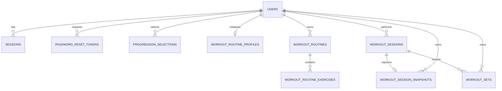

# Модель данных Forma

Статус: **TARGET — локальная схема, миграция production не применена**

Схема определена в `db/schema.ts` и применяется миграциями из `drizzle/`.
Физическое хранилище — Cloudflare D1 (SQLite).

## Общие соглашения

- Основные идентификаторы — строковые UUID, создаваемые `crypto.randomUUID()`.
- Исключение: `workout_sets.id` детерминирован как
  `<workoutSessionId>:<exerciseKey>:<setNumber>`.
- Время хранится как целое число Unix time в миллисекундах.
- `birth_date` хранится строкой `YYYY-MM-DD`.
- Булевы значения в текущей схеме отсутствуют.
- Enum-подобные значения представлены `TEXT` и валидируются приложением.
- Все пользовательские дочерние сущности удаляются каскадно вместе с пользователем.
- Каталог упражнений не является таблицей: его источник истины —
  `lib/workout-catalog.ts`.

## Диаграмма связей



`progression_selections.exercise_key` и
`workout_routine_exercises.exercise_key` логически ссылаются на статический каталог,
но не имеют внешнего ключа. `workout_session_snapshots.routine_id` также намеренно
не является внешним ключом: snapshot должен пережить изменение или удаление набора.

## Таблицы

### `users`

Учётная запись и профиль пользователя.

| Колонка | Тип | Ограничения | Смысл |
|---|---|---|---|
| `id` | `TEXT` | PK | UUID пользователя |
| `email` | `TEXT` | NOT NULL, UNIQUE | нормализованный email |
| `password_hash` | `TEXT` | NOT NULL | PBKDF2 hash в собственном строковом формате |
| `name` | `TEXT` | NOT NULL | отображаемое имя |
| `gender` | `TEXT` | NOT NULL | `male`, `female`, `unspecified` |
| `birth_date` | `TEXT` | NOT NULL | дата в форме `YYYY-MM-DD` |
| `created_at` | `INTEGER` | NOT NULL | время создания |
| `updated_at` | `INTEGER` | NOT NULL | время последнего изменения |

Индекс: уникальный `users_email_unique(email)`.

Формат `password_hash`:

```text
pbkdf2$100000$<base64url-salt>$<base64url-derived-key>
```

### `sessions`

Серверные сессии входа.

| Колонка | Тип | Ограничения | Смысл |
|---|---|---|---|
| `id` | `TEXT` | PK | SHA-256 от cookie token |
| `user_id` | `TEXT` | NOT NULL, FK → `users.id`, ON DELETE CASCADE | владелец |
| `expires_at` | `INTEGER` | NOT NULL | окончание действия |
| `created_at` | `INTEGER` | NOT NULL | время создания |

Один пользователь может иметь несколько параллельных сессий. Срок новой сессии —
30 дней.

### `password_reset_tokens`

Одночасовые токены запроса восстановления пароля.

| Колонка | Тип | Ограничения | Смысл |
|---|---|---|---|
| `id` | `TEXT` | PK | SHA-256 от исходного reset token |
| `user_id` | `TEXT` | NOT NULL, FK → `users.id`, ON DELETE CASCADE | пользователь |
| `expires_at` | `INTEGER` | NOT NULL | окончание действия |
| `created_at` | `INTEGER` | NOT NULL | время создания |

Таблица уже заполняется, но потребление токена и смена пароля ещё не реализованы.

### `workout_routine_profiles`

Одноразовый маркер инициализации стартовых наборов.

| Колонка | Тип | Ограничения | Смысл |
|---|---|---|---|
| `user_id` | `TEXT` | PK, FK → `users.id`, ON DELETE CASCADE | пользователь |
| `initialized_at` | `INTEGER` | NOT NULL | время инициализации |

Наличие строки означает, что автоматически создавать стартовые наборы больше не
нужно, даже если пользователь затем удалил их все.

### `workout_routines`

Пользовательский набор упражнений.

| Колонка | Тип | Ограничения | Смысл |
|---|---|---|---|
| `id` | `TEXT` | PK | UUID набора |
| `user_id` | `TEXT` | NOT NULL, FK → `users.id`, ON DELETE CASCADE | владелец |
| `name` | `TEXT` | NOT NULL | название, максимум 80 символов на уровне API |
| `duration_minutes` | `INTEGER` | NOT NULL | план, от 5 до 240 минут |
| `difficulty` | `TEXT` | NOT NULL | `easy`, `medium`, `hard` |
| `created_at` | `INTEGER` | NOT NULL | время создания |
| `updated_at` | `INTEGER` | NOT NULL | время последнего изменения |

### `workout_routine_exercises`

Упорядоченный состав набора.

| Колонка | Тип | Ограничения | Смысл |
|---|---|---|---|
| `routine_id` | `TEXT` | PK part, FK → `workout_routines.id`, ON DELETE CASCADE | набор |
| `exercise_key` | `TEXT` | PK part | ключ упражнения в статическом каталоге |
| `position` | `INTEGER` | NOT NULL | позиция в наборе, начиная с 0 |

Составной PK `(routine_id, exercise_key)` запрещает повтор одного упражнения внутри
набора. Уникальность `position` на уровне БД не задана.

### `progression_selections`

Пользовательский выбор прогрессии для упражнения в контексте набора.

| Колонка | Тип | Ограничения | Смысл |
|---|---|---|---|
| `user_id` | `TEXT` | PK part, FK → `users.id`, ON DELETE CASCADE | владелец |
| `workout_type` | `TEXT` | PK part | scope в форме `routine:<routineId>` |
| `exercise_key` | `TEXT` | PK part | ключ упражнения |
| `progression` | `TEXT` | NOT NULL | выбранное название прогрессии |
| `updated_at` | `INTEGER` | NOT NULL | время изменения |

Физическое имя `workout_type` осталось от ранней модели PUSH/PULL. Текущий API
интерпретирует поле как scope и работает только со значениями `routine:*`.

### `workout_sessions`

Экземпляр прохождения тренировки.

| Колонка | Тип | Ограничения | Смысл |
|---|---|---|---|
| `id` | `TEXT` | PK | UUID тренировки |
| `user_id` | `TEXT` | NOT NULL, FK → `users.id`, ON DELETE CASCADE | владелец |
| `workout_type` | `TEXT` | NOT NULL | для новых записей `routine`; legacy: `push`/`pull` |
| `status` | `TEXT` | NOT NULL, DEFAULT `active` | `active`, `completed`; миграция может пометить старый дубль `superseded` |
| `started_at` | `INTEGER` | NOT NULL | начало |
| `completed_at` | `INTEGER` | NULL | завершение |
| `duration_seconds` | `INTEGER` | NULL | фактическая длительность |

Для активной тренировки `completed_at` и `duration_seconds` равны `NULL`.
Частичный уникальный индекс `workout_sessions_one_active_user_idx(user_id) WHERE
status = 'active'` закрепляет условие «не больше одной активной тренировки на
пользователя». Перед созданием индекса миграция оставляет active только у самой
новой из возможных старых дублей, остальные помечает `superseded`.

### `workout_session_snapshots`

Снимок набора на момент начала тренировки.

| Колонка | Тип | Ограничения | Смысл |
|---|---|---|---|
| `workout_session_id` | `TEXT` | PK, FK → `workout_sessions.id`, ON DELETE CASCADE | тренировка |
| `user_id` | `TEXT` | NOT NULL, FK → `users.id`, ON DELETE CASCADE | владелец |
| `routine_id` | `TEXT` | NULL | исходный набор без FK |
| `routine_name` | `TEXT` | NOT NULL | сохранённое название |
| `duration_minutes` | `INTEGER` | NOT NULL | сохранённый план |
| `difficulty` | `TEXT` | NOT NULL | сохранённая сложность |
| `exercises_json` | `TEXT` | NOT NULL | JSON-массив полных объектов `Exercise` |

`exercises_json` денормализован намеренно: история должна отображаться по данным,
актуальным на момент старта, даже если статический каталог или набор изменились.
Корректность JSON обеспечивается кодом записи, не ограничением БД.

### `workout_sets`

Фактически выполненный подход.

| Колонка | Тип | Ограничения | Смысл |
|---|---|---|---|
| `id` | `TEXT` | PK | детерминированный ID подхода |
| `user_id` | `TEXT` | NOT NULL, FK → `users.id`, ON DELETE CASCADE | владелец |
| `workout_session_id` | `TEXT` | NOT NULL, FK → `workout_sessions.id`, ON DELETE CASCADE | тренировка |
| `exercise_key` | `TEXT` | NOT NULL | упражнение |
| `progression` | `TEXT` | NOT NULL | выполненная прогрессия |
| `set_number` | `INTEGER` | NOT NULL | номер подхода, от 1 |
| `target_value` | `INTEGER` | NOT NULL | план повторов или секунд |
| `actual_value` | `INTEGER` | NOT NULL | фактическое значение |
| `unit` | `TEXT` | NOT NULL | обычно `повтора` или `сек` |
| `effort` | `TEXT` | NULL | `easy`, `reserve`, `hard` или `NULL` |
| `completed_at` | `INTEGER` | NOT NULL | время последней записи подхода |

Уникальный индекс
`workout_sets_session_exercise_set_idx(workout_session_id, exercise_key, set_number)`
обеспечивает идемпотентный UPSERT одного подхода.

## Инварианты приложения

Следующие правила важны для модели и в основном обеспечиваются кодом API:

- пользователь читает и изменяет только свои сущности;
- набор содержит хотя бы одно известное упражнение;
- новый snapshot создаётся только из текущего набора пользователя;
- подход можно записать только в активную тренировку пользователя;
- завершить можно только активную тренировку пользователя;
- enum-подобные значения имеют ограниченный набор допустимых строк;
- `completed_at` и `duration_seconds` заполняются при переходе в `completed`.

Единственность active session обеспечивается также самой D1 частичным уникальным
индексом. Первый незавершённый подход не хранится отдельной колонкой: API
вычисляет его из `workout_session_snapshots.exercises_json` и уникальных пар
`workout_sets(exercise_key, set_number)`.

При прямой записи в БД эти правила можно нарушить, поэтому административные
скрипты должны повторять валидацию приложения.

## Жизненный цикл и удаление

- Удаление пользователя каскадно удаляет сессии, reset-токены, наборы, тренировки,
  snapshots и подходы.
- Удаление набора каскадно удаляет его состав. API дополнительно явно удаляет его
  `progression_selections`.
- Удаление тренировки каскадно удаляет snapshot и подходы.
- `POST /api/workouts/:id/discard` удаляет только принадлежащую пользователю
  сессию со статусом `active`. Такая сессия не переводится в `completed`, поэтому
  не появляется в истории и не участвует в статистике; повтор удаления безопасен.
- Удаление или изменение набора не меняет существующий snapshot тренировки.
- Истёкшие сессии и reset-токены остаются в таблицах до явной очистки.

## Изменение схемы

1. Изменить `db/schema.ts`.
2. Сгенерировать миграцию:

   ```bash
   npm run db:generate
   ```

3. Проверить созданный SQL в `drizzle/`.
4. Применить локально:

   ```bash
   npm run db:migrate:local
   ```

5. После проверки применить к production D1:

   ```bash
   npm run db:migrate:remote
   ```

Схему production нельзя изменять вручную в обход версионируемых миграций.
