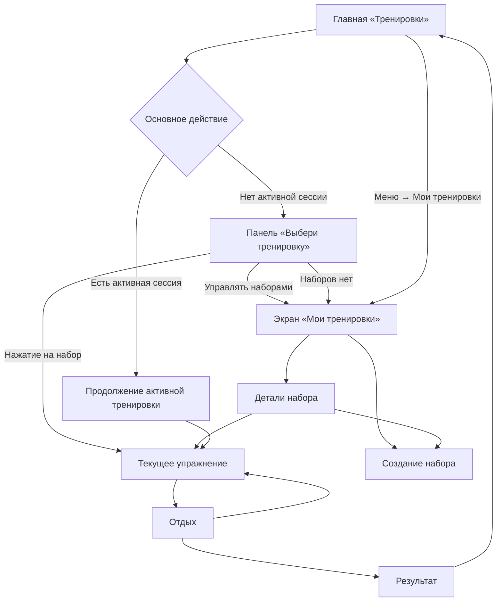

# Изменённая структура приложения

## 1. Информационная архитектура

## 2. Главная

На главной остаются:

1. статистика тренировок;
2. текущий цикл;
3. прогресс с прошлой тренировки;
4. меню;
5. закреплённая зона основного действия.

С главной удаляются:

- заголовок «Мои тренировки»;
- карточки наборов;
- ссылка «Все»;
- действие «Новый набор».

## 3. Закреплённая зона действия

Зона находится вне прокручиваемой части экрана и всегда видима.

Она имеет только два продуктовых состояния:

1. **Начать:** одна кнопка «Начать тренировку».
2. **Продолжить:** подпись с активным набором и кнопка
   «Продолжить тренировку».

Загрузка и ошибка являются техническими под-состояниями этих двух состояний и
не вводят третью подпись основной кнопки.

## 4. Панель выбора набора

Панель является временным слоем поверх главной, а не отдельным маршрутом.

Содержит:

- заголовок «Выбери тренировку»;
- пояснение «Нажми на набор, чтобы сразу начать»;
- список всех доступных наборов;
- действие «Управлять наборами»;
- закрытие без запуска.

Нажатие на набор не открывает его детали, а сразу создаёт тренировочную сессию.

## 5. Экран «Мои тренировки»

Экран становится единственным местом управления наборами:

- просмотр всех наборов;
- создание;
- переход в детали;
- последующее редактирование и удаление.

Он доступен из панели выбора и из меню главной.

## 6. Термины

- **Набор** (`routine`) — редактируемый шаблон тренировки.
- **Тренировка / сессия** (`workout session`) — запущенный снимок набора.
- **Активная тренировка** — единственная незавершённая сессия пользователя.
- **Первый незавершённый подход** — первая пара
  `упражнение + номер подхода`, для которой нет сохранённого результата.

