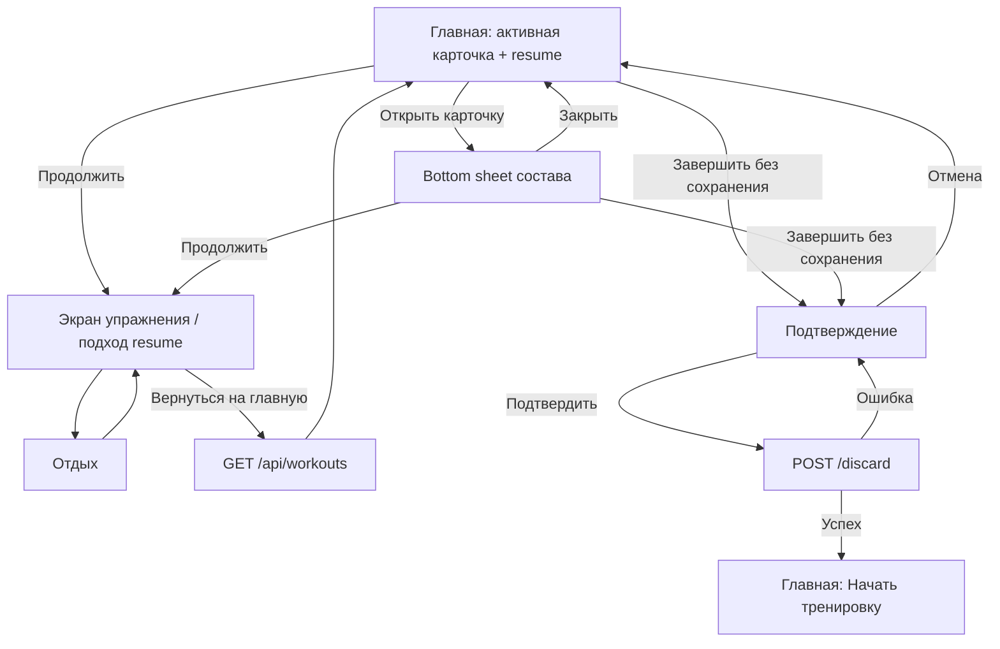

# Сквозной user flow

Фича-пакет: `discard_active_workout`
Область: активная тренировка на главной

## Зависимые экраны

1. Главная без активной тренировки.
2. Главная с активной тренировкой.
3. Bottom sheet состава активной тренировки.
4. Экран текущего упражнения и подхода.
5. Экран отдыха и следующее упражнение.
6. Подтверждение завершения без сохранения.
7. Главная после отказа.

Неизменённые части главной, экран истории и обычный summary не проектируются
заново; они участвуют только в проверке результата.

## UF-01. Увидеть, что будет продолжено

**Предусловия:** `GET /api/workouts` вернул активную сессию и `resume`.

1. Пользователь открывает главную.
2. Система показывает название snapshot.
3. Система берёт упражнение по `resume.exerciseIndex`.
4. Карточка показывает название упражнения и
   `подход resume.setNumber из exercise.sets`.
5. Пользователь понимает точку продолжения без перехода с главной.

## UF-02. Посмотреть полный состав

1. Пользователь нажимает карточку с chevron `›`.
2. Открывается bottom sheet поверх главной.
3. В заголовке показаны название snapshot и общий прогресс.
4. Упражнения показаны в порядке `active.exercises`.
5. Прошлые упражнения отмечены `Выполнено`.
6. Упражнение по `resume.exerciseIndex` выделено и подписано
   `Продолжим отсюда`.
7. Предстоящие упражнения показывают план, но не нажимаются.

**Выходы:**

- закрыть sheet — вернуться на главную без изменений;
- продолжить — перейти в UF-03;
- завершить без сохранения — перейти в UF-05.

## UF-03. Продолжить из карточки или состава

Путь A:

1. На главной нажать `Продолжить тренировку`.

Путь B:

1. Открыть состав.
2. Нажать `Продолжить: подход N`.

Общий результат:

1. Система закрывает sheet, если он открыт.
2. Вызывает существующий `resumeWorkout()`.
3. Открывает `active.exercises[resume.exerciseIndex]`.
4. Устанавливает номер подхода `resume.setNumber`.
5. Новая сессия и новый snapshot не создаются.

## UF-04. Выполнить подход и вернуться

1. Пользователь завершает подход на экране упражнения.
2. Система сохраняет `workout_set`.
3. После отдыха пользователь может выйти на главную.
4. Главная повторно загружает `GET /api/workouts`.
5. Карточка и sheet показывают уже новую первую незавершённую позицию.

Локальная устаревшая позиция не должна оставаться источником истины после
успешного обновления сервера.

## UF-05. Завершить без сохранения из состава

1. Пользователь нажимает `Завершить без сохранения` в sheet.
2. Sheet состава закрывается или заменяется подтверждением; два overlay
   одновременно не показываются.
3. Пользователь подтверждает destructive-действие.
4. Система вызывает `POST /api/workouts/:id/discard`.
5. После успеха активная карточка исчезает.
6. Главная показывает `Начать тренировку`.
7. История, статистика и прогресс цикла не изменяются.

## UF-06. Отмена отказа

1. Пользователь закрывает подтверждение или нажимает
   `Продолжить тренировку`.
2. Подтверждение закрывается.
3. Если вход был из состава, система возвращает в sheet состава.
4. Если вход был с карточки, система возвращает на главную.
5. Фокус возвращается на исходное действие.

## UF-07. Ошибки и конкурирующее изменение

- Ошибка загрузки главной: карточка не строится из частичных данных, доступно
  `Повторить`.
- Ошибка отказа: подтверждение остаётся открытым, активные данные не очищаются.
- Сессия завершена на другом устройстве: после обновления карточка исчезает,
  sheet закрывается.
- Snapshot существует, но `resume` равен `null`: показать
  `Все подходы выполнены` и направить пользователя в существующий безопасный
  сценарий завершения с сохранением, не в первое упражнение.

## Диаграмма

