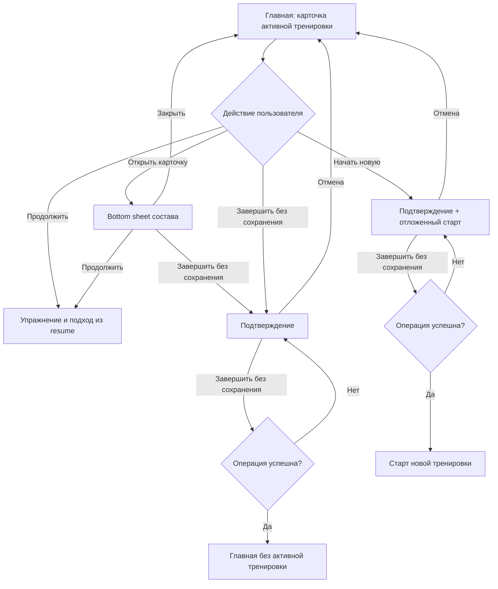

# UX и пользовательские сценарии

Фича: `discard_active_workout`

## UX-изменение

### Карточка активной тренировки

Сохранить главным действием `Продолжить тренировку`. Компактную строку
`Сейчас выполняется` превратить в интерактивную карточку активной сессии.

Карточка показывает:

- сохранённое название набора из snapshot;
- текущую позицию: название упражнения и номер следующего подхода;
- chevron `›`, обозначающий переход к составу;
- менее заметное действие `Завершить без сохранения`.

Рекомендуемая иерархия:

- `Продолжить тренировку` — primary;
- карточка с chevron `›` — переход к составу;
- `Завершить без сохранения` — tertiary, без красной заливки;
- красный destructive-стиль использовать только в подтверждении.

Так действие остаётся доступным, но вероятность случайной потери прогресса
остаётся низкой.

### Точка продолжения

Если `active.resume` содержит `{ exerciseIndex, setNumber }`, карточка показывает:

`Продолжим: <название упражнения> · подход <setNumber> из <sets>`

Источник названия и количества подходов — `active.exercises[exerciseIndex]`.
Номер не вычисляется из локального экрана и не хранится отдельно.

Primary CTA может остаться коротким `Продолжить тренировку`, потому что точная
позиция уже видна непосредственно над ним.

### Просмотр состава

Нажатие на карточку открывает bottom sheet. Отдельная видимая подпись
`Посмотреть состав` не используется: достаточно chevron `›`. Для screen reader
вся карточка имеет доступное имя `Посмотреть состав активной тренировки
<название>`.

- название активной тренировки;
- сводка `Выполнено X из Y упражнений`;
- список упражнений snapshot в исходном порядке;
- состояние каждого упражнения;
- primary CTA с точкой продолжения;
- tertiary-действие `Завершить без сохранения`.

Состояния строки:

- **выполнено** — все подходы упражнения сохранены, отметка `✓`;
- **текущее** — упражнение по `resume.exerciseIndex`, lime-подсветка и подпись
  `Продолжим отсюда · подход N из M`;
- **впереди** — нейтральная строка с планом `M × target unit`.

Строки списка не являются навигацией: пользователь не может перескочить к
произвольному упражнению. Продолжение всегда использует серверный `resume`.

Закрытие sheet возвращает фокус на карточку и не меняет тренировку.

### Подтверждение

На мобильном устройстве использовать bottom sheet, на широком экране — modal.

Содержимое:

- заголовок: `Завершить тренировку?`;
- пояснение: `Текущий прогресс не сохранится в истории и статистике. Это действие нельзя отменить.`;
- destructive-действие: `Завершить без сохранения`;
- безопасное действие: `Продолжить тренировку`.

Sheet/modal нельзя закрывать destructive-действием по нажатию вне области.
Нажатие вне области, системная кнопка Back и свайп вниз равнозначны отмене.

Во время запроса destructive-кнопка показывает загрузку, а оба действия
блокируются. Это предотвращает двойное завершение.

### После успешного завершения

При прямом завершении с карточки:

- закрыть подтверждение;
- убрать карточку активной тренировки;
- показать обычное состояние главной страницы с CTA `Начать тренировку`;
- показать toast `Тренировка завершена без сохранения`.

При попытке начать новую тренировку:

- после подтверждения автоматически открыть выбранный пользователем сценарий
  старта новой тренировки;
- не заставлять пользователя повторно нажимать `Начать тренировку`;
- toast можно не показывать, чтобы не конкурировать с экраном старта.

### Ошибка

Подтверждение остаётся открытым. Текст:
`Не удалось завершить тренировку. Проверьте соединение и попробуйте снова.`

Кнопка снова становится доступной. Активная тренировка не исчезает до
подтверждённого успеха.

## Основной сценарий: завершить с главной страницы

**Предусловие:** у пользователя есть активная тренировка.

1. Пользователь открывает главную страницу.
2. Видит карточку активной тренировки с действиями `Продолжить тренировку` и
   `Завершить`.
3. Нажимает `Завершить`.
4. Система показывает подтверждение и объясняет, какие данные будут потеряны.
5. Пользователь нажимает `Завершить без сохранения`.
6. Система завершает активную тренировку без записи результатов.
7. Карточка исчезает, появляется CTA `Начать тренировку`.
8. Пользователь может начать новую тренировку.

## Основной сценарий: посмотреть состав и продолжить

**Предусловие:** у пользователя есть активная тренировка и сохранённый `resume`.

1. Пользователь открывает главную.
2. Видит карточку `Push day` и строку
   `Продолжим: Отжимания на брусьях · подход 3 из 4`.
3. Нажимает карточку активной тренировки.
4. Система открывает bottom sheet и показывает упражнения snapshot.
5. Пользователь видит выполненные упражнения, текущую точку и оставшийся план.
6. Нажимает `Продолжить: подход 3`.
7. Sheet закрывается, открывается экран упражнения из `resume`.

Если пользователь нажимает primary CTA прямо на главной, шаги 3–5 пропускаются,
а результат остаётся тем же.

## Альтернативный сценарий: начать новую при активной тренировке

**Предусловие:** активная тренировка существует, а интерфейс позволяет выбрать
новую тренировку.

1. Пользователь нажимает `Начать новую тренировку` или выбирает шаблон.
2. Система показывает подтверждение завершения текущей тренировки.
3. Пользователь нажимает `Завершить без сохранения`.
4. Система удаляет текущий прогресс.
5. Система автоматически продолжает исходный сценарий и открывает выбранную
   новую тренировку/экран её настройки.

## Отмена

1. Пользователь открывает подтверждение.
2. Нажимает `Продолжить тренировку`, Back, свайпает sheet вниз или закрывает
   modal.
3. Система закрывает подтверждение.
4. Активная тренировка и весь введённый прогресс остаются без изменений.

## Ошибка завершения

1. Пользователь подтверждает завершение без сохранения.
2. Сервер или локальное хранилище возвращает ошибку.
3. Система сохраняет активную тренировку, показывает inline-ошибку и позволяет
   повторить действие.
4. При повторном успехе применяется соответствующий основной или альтернативный
   сценарий.

## Схема переходов

## Доступность

- Фокус при открытии попадает на заголовок подтверждения; затем — на безопасное
  действие.
- При открытии состава фокус попадает на заголовок sheet; список читается в
  порядке snapshot, а текущая строка имеет доступную подпись
  `Текущее упражнение`.
- После закрытия состава фокус возвращается на карточку активной тренировки.
- После закрытия без действия фокус возвращается на исходную кнопку.
- После успеха фокус переносится на `Начать тренировку`.
- У кнопок есть доступные имена, а состояние загрузки объявляется screen reader.
- Destructive-действие обозначается не только цветом.
- Минимальная область нажатия — 44×44 pt или платформенный эквивалент.
