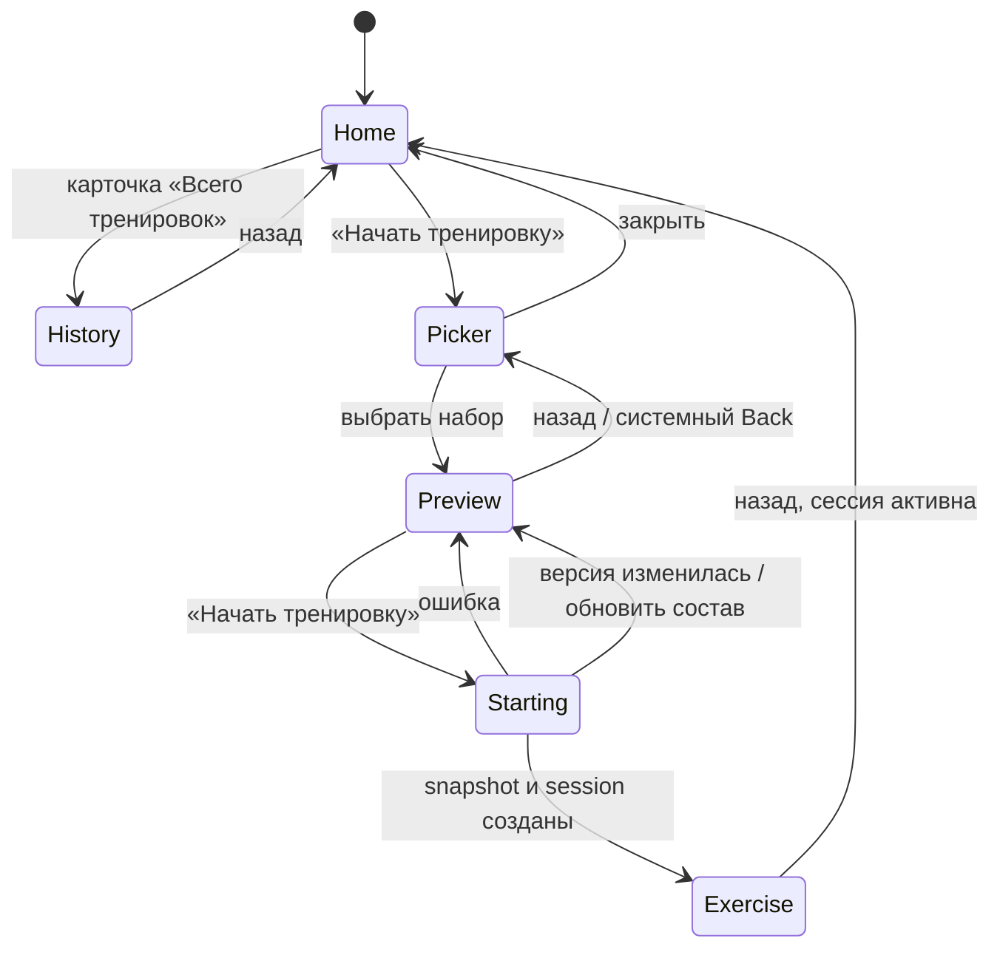

# User flow

## UF-01. Проверить и начать тренировку

**Предусловия:** активной сессии нет, существует хотя бы один набор.

1. Пользователь нажимает `Начать тренировку` на главной.
2. Открывается `Выбери тренировку`.
3. Пользователь выбирает набор.
4. Открывается `Состав тренировки`.
5. Пользователь сверяет название, параметры и упражнения.
6. Нажимает `Начать тренировку`.
7. Система валидирует версию, создаёт snapshot и активную сессию.
8. Открывается первое упражнение, подход 1.

**Результат:** пользователь начинает именно тот состав, который видел перед
подтверждением.

## UF-02. Выбран не тот набор

1. Пользователь находится на экране состава.
2. Понимает, что выбрал не тот набор.
3. Нажимает назад.
4. Возвращается в picker к ранее выбранной карточке.
5. Выбирает другой набор либо закрывает picker.

**Результат:** активная сессия не создана.

## UF-03. Набор изменился

1. Пользователь открыл состав.
2. До подтверждения набор был изменён в другом контексте.
3. Пользователь нажимает `Начать тренировку`.
4. Сервер отклоняет устаревшую версию.
5. Экран обновляет состав и просит проверить его снова.
6. Пользователь повторно подтверждает либо возвращается.

## UF-04. История с главной

1. Пользователь видит число завершённых тренировок.
2. В той же карточке видит строку `История ›`.
3. Нажимает любую точку карточки.
4. Открывается экран истории.

## Общая схема

