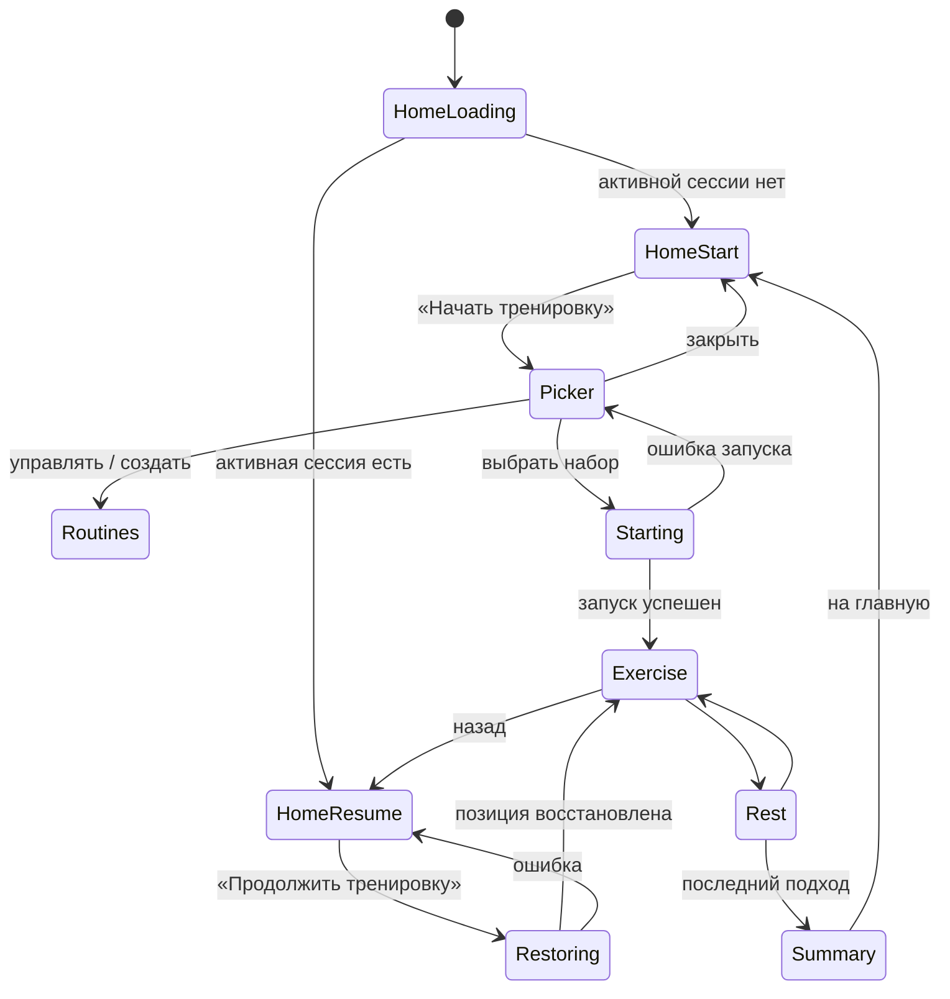

# User flow

## UF-01. Новый запуск при наличии наборов

**Предусловия:** пользователь авторизован, активной сессии нет, есть хотя бы
один набор.

1. Пользователь открывает главную.
2. Видит закреплённую кнопку «Начать тренировку».
3. Нажимает кнопку.
4. Открывается панель «Выбери тренировку».
5. Пользователь нажимает нужный набор.
6. Система создаёт сессию и снимок набора.
7. Открывается первое упражнение, подход 1.

**Основной результат:** запуск выполнен за два нажатия.

**Альтернативы:**

- закрыть панель — ничего не меняется;
- выбрать «Управлять наборами» — открыть полный список;
- получить ошибку — остаться в контексте выбора и повторить.

## UF-02. Продолжение активной тренировки

**Предусловие:** существует активная сессия.

1. Пользователь открывает или обновляет главную.
2. Над CTA видит название активной тренировки.
3. Видит кнопку «Продолжить тренировку».
4. Нажимает кнопку.
5. Система определяет первый незавершённый подход.
6. Открывается соответствующее упражнение и подход.

**Основной результат:** продолжение выполнено за одно нажатие, новая сессия не
создана.

## UF-03. Первый набор

**Предусловия:** активной сессии нет, наборов нет.

1. Пользователь нажимает «Начать тренировку».
2. Панель сообщает, что тренировок пока нет.
3. Пользователь нажимает «Создать тренировку».
4. Открывается экран «Мои тренировки».
5. Пользователь запускает существующий сценарий создания набора.
6. После сохранения открываются детали созданного набора.

Автоматический запуск только что созданного набора в эту итерацию не требуется.

## UF-04. Управление наборами

Путь A:

1. «Начать тренировку».
2. «Управлять наборами».
3. Экран «Мои тренировки».

Путь B:

1. Меню главной.
2. «Мои тренировки».

На экране доступны просмотр, создание и переход в детали набора.

## UF-05. Возврат из тренировки

Если пользователь начал или продолжил тренировку с главной и нажал «Назад»:

1. открывается главная;
2. сессия остаётся активной;
3. показаны название и «Продолжить тренировку».

Возврат не завершает и не отменяет сессию.

## UF-06. Завершение

После завершения последнего подхода:

1. сессия получает статус `completed`;
2. активное состояние очищается;
3. показывается результат;
4. после возврата на главную CTA снова имеет подпись «Начать тренировку».

## Общая схема

