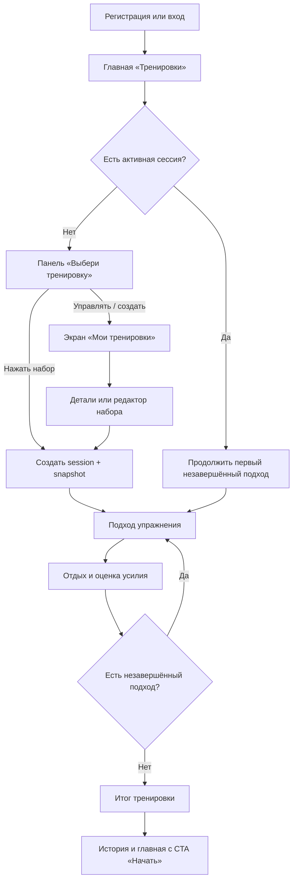

# Forma — основной сквозной сценарий

Статус: **TARGET / реализовано локально, не опубликовано**

## Цель пользователя

Быстро начать подходящую тренировку по калистенике, пройти все подходы и
сохранить результат, не теряя активную сессию после возврата, перезагрузки или
изменения исходного набора.

## Схема

## Happy path

1. После входа пользователь видит аналитику и закреплённое действие
   «Начать тренировку».
2. Нажимает CTA, затем карточку нужного набора в bottom sheet.
3. Система атомарно создаёт единственную active session и неизменяемый snapshot.
4. Открывается первое упражнение, подход 1.
5. Пользователь сохраняет подходы, при желании оценивает усилие и проходит отдых.
6. Возврат из выполнения открывает главную; активная сессия и её название
   остаются доступны через «Продолжить тренировку».
7. После перезагрузки API вычисляет первую незавершённую позицию по snapshot и
   сохранённым подходам.
8. После последнего подхода сессия завершается, попадает в историю, а CTA снова
   становится «Начать тренировку».

## Ключевые развилки

- **Нет наборов:** панель предлагает «Создать тренировку» и ведёт в полный
  список, где доступен конструктор.
- **Нужно управление:** панель и меню ведут на экран «Мои тренировки».
- **Набор изменён или удалён:** active session продолжает использовать snapshot.
- **Параллельный старт:** сервер возвращает существующую active session либо
  создаёт ровно одну.
- **Ошибка загрузки:** главная остаётся доступной, CTA недоступен, есть повтор.
- **Ошибка запуска/продолжения:** пользователь остаётся в текущем контексте и
  может безопасно повторить действие.
- **Все подходы сохранены:** сессия безопасно завершается, а не открывается с
  первого подхода.

## Критерии успешности

- Новый запуск с главной занимает два нажатия.
- Продолжение с главной занимает одно нажатие.
- Главная не содержит блок «Мои тренировки» и действий создания набора.
- После возврата и перезагрузки открывается первый незавершённый подход.
- Закреплённая зона видна на мобильной ширине, учитывает safe area и не
  перекрывает последний элемент контента.
- Редактирование или удаление исходного набора не меняет snapshot.

## Детализация

- Требования: [business-requirements.md](specs/business-requirements.md)
- Все сценарии и ошибки: [user-scenarios.md](specs/user-scenarios.md)
- Feature-пакет: [главная — быстрый запуск](../features/main_page/quick_start_workout/README.md)
- Интерфейс: [актуальный прототип](prototypes/current.html)
