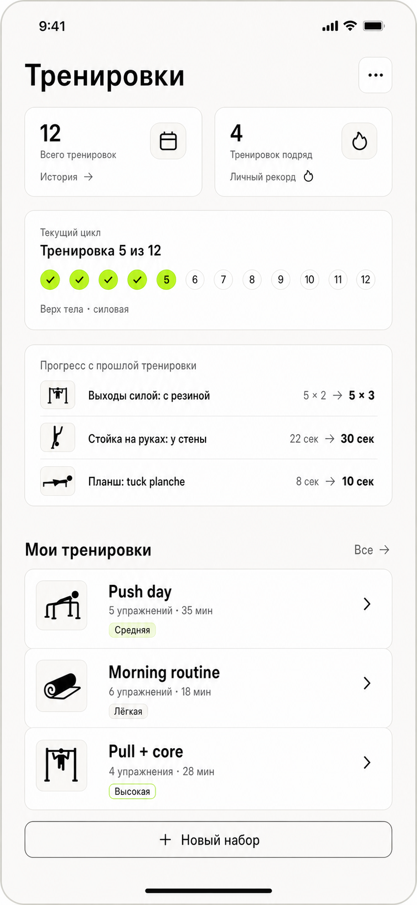
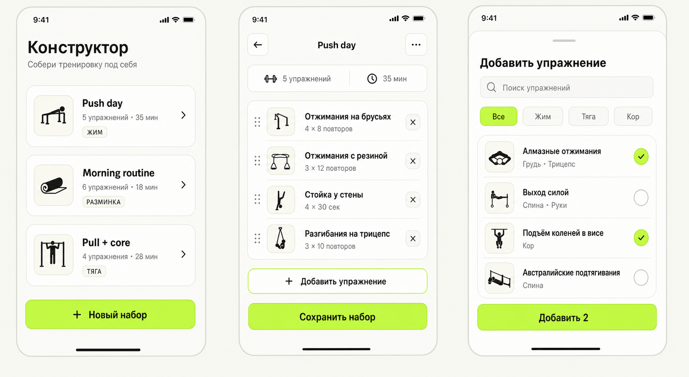

# Макеты Forma

## Актуальные

### Главная «Тренировки» — быстрый запуск

Целевое и реализованное локально поведение главной зафиксировано в
[feature-пакете быстрого запуска](../../features/main_page/quick_start_workout/README.md) и
[основном кликабельном прототипе](../prototypes/current.html):

- на главной нет блока карточек наборов;
- запуск и продолжение доступны в закреплённой нижней зоне;
- выбор набора открывается в bottom sheet.

Отдельный новый PNG для этой итерации не создавался: визуальным источником
является кликабельный HTML.

### Предыдущий статичный референс главной

[Открыть PNG](current/home.png)

PNG сохраняет предыдущую baseline-композицию с карточками пользовательских
наборов для сравнения и больше не определяет целевое поведение главной.

### Конструктор набора

[Открыть PNG](current/exercise-builder-flow.png)

Сценарий просмотра набора, редактирования состава и добавления упражнений.

## Концепты и история решений

Эти варианты сохранены для истории, но не являются источником текущего
поведения:

- [Упрощённый список наборов](concepts/home-routine-list-simple.png)
- [Редизайн главной, вариант 1](concepts/home-routines-redesign.png)
- [Редизайн главной, вариант 2](concepts/home-routines-redesign-v2.png)
- [Конструктор прогрессии — 1. Каркас](concepts/progression-builder-step-1-framework.png)
- [Конструктор прогрессии — 2. Движения](concepts/progression-builder-step-2-movements.png)
- [Конструктор прогрессии — 3. Дерево](concepts/progression-builder-step-3-tree.png)
- [Конструктор прогрессии — 4. Итог](concepts/progression-builder-step-4-complete.png)

Полный актуальный кликабельный интерфейс хранится отдельно:
[актуальный HTML-прототип](../prototypes/current.html).
